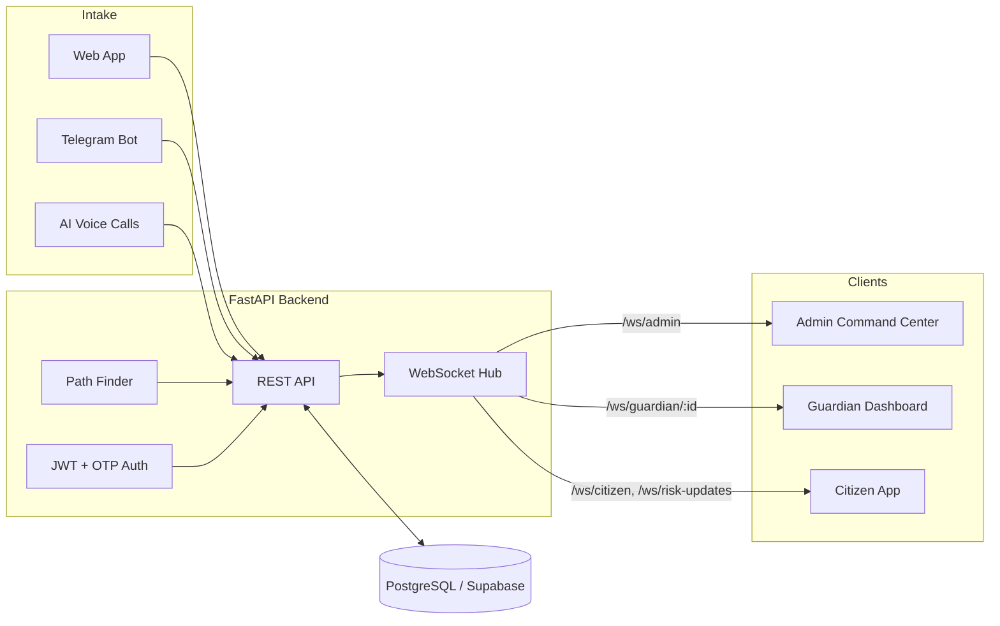

<div align="center">

# 🛡️ SafePulse

**Predictive Safety Intelligence Platform**

*Detect risk early. Respond faster.*

[](https://safepulse.teamcodezilla.in)
[](https://react.dev)
[](https://vitejs.dev)
[](https://fastapi.tiangolo.com)
[](https://supabase.com)
[](https://vercel.com)

</div>

SafePulse is a real-time citizen safety platform that gathers safety signals from multiple channels (web, Telegram, AI voice calls), converts them into **live safety intelligence**, and helps admins and guardians respond to danger before it escalates.

<!-- 📸 Add a dashboard screenshot or demo GIF here -->

---

## Table of Contents

- [Features](#features)
- [How It Works](#how-it-works)
- [Architecture](#architecture)
- [Tech Stack](#tech-stack)
- [Project Structure](#project-structure)
- [Getting Started](#getting-started)
- [Environment Variables](#environment-variables)
- [Real-Time Channels](#real-time-channels)
- [Deployment](#deployment)
- [Roles & Access](#roles--access)
- [Contributing](#contributing)

---

## Features

| Feature | Description |
|---|---|
| 🚨 **Multi-channel intake** | Citizens report via web, Telegram bot, or AI voice calls |
| 🛡️ **Guardian response** | Targeted real-time SOS alerts with accept/respond workflow |
| 🖥️ **Admin command center** | Live monitoring of reports, risk zones, and operations |
| 🗺️ **Route risk scoring** | Path Finder scores route polylines against active risk zones |
| ⚡ **Real-time updates** | WebSocket channels replace refresh-based polling |
| 🔑 **Auth & verification** | JWT, OTP verification, Google OAuth, role-based access |
| 🤖 **Safety automation** | Failsafe, Silent Witness, Oracle, and Anchor workflow modules |

## How It Works

<details>
<summary><b>Lifecycle of a safety report (click to expand)</b></summary>

1. A citizen submits a signal - web form, Telegram message, or AI voice call
2. The FastAPI backend validates, stores, and classifies the report
3. Risk zones update; the Path Finder re-scores affected routes
4. WebSocket channels broadcast instantly:
   - Admins see it in the command center
   - Assigned guardians receive a targeted alert
   - Citizens on affected routes get warnings
5. Guardians respond; admins oversee resolution

</details>

## Architecture



## Tech Stack

| Layer | Technology |
|---|---|
| Frontend | React, TypeScript, Vite |
| Backend | FastAPI (Python 3.11), async SQLAlchemy |
| Database | PostgreSQL (Supabase) |
| Real-time | Native WebSockets |
| Auth | JWT, OTP, Google OAuth |
| Integrations | Telegram Bot API, Twilio, Firebase, Mapbox, Resend |
| Hosting | Vercel (frontend), Render (backend) |

## Project Structure

```
SafePulse/
├── src/                          # React + TypeScript frontend
│   ├── pages/
│   │   ├── AdminDashboard.tsx    # Live command center
│   │   ├── GuardianDashboard.tsx # Alert response center
│   │   └── WalkthroughPage.tsx   # Onboarding
│   └── sections/                 # Hero, Vision, Oracle, Failsafe
├── backend/
│   ├── app/
│   │   ├── main.py               # Entry: CORS, DB init, route registration
│   │   ├── config/settings.py    # Env-based configuration
│   │   └── routes/               # auth, users, otp, reports, telegram,
│   │                             # websocket, pathfinder, failsafe,
│   │                             # silent_witness, oracle, anchor, map
│   └── requirements.txt
├── render.yaml                   # Render deploy config (backend)
├── vercel.json                   # SPA rewrites (frontend)
├── vite.config.ts                # Dev proxy → localhost:8000
└── PRODUCTION_DEPLOYMENT_GUIDE.md
```

## Getting Started

### Prerequisites

- Node.js 18+
- Python 3.11
- PostgreSQL / Supabase database
- Optional (feature-dependent): Telegram bot token, Twilio, Firebase, Mapbox, Google OAuth, Resend

### Frontend

```bash
# from the repository root
npm install
npm run dev
```

Runs at `http://localhost:3000`. The Vite proxy forwards API calls to `http://localhost:8000`.

### Backend

```bash
cd backend
pip install -r requirements.txt
uvicorn app.main:app --reload --host 0.0.0.0 --port 8000
```

Runs at `http://localhost:8000`.

> **Note:** In development mode the backend auto-creates tables and bootstraps a default admin user, so you can explore immediately.

## Environment Variables

<details>
<summary><b>Backend (<code>backend/.env</code>)</b></summary>

| Variable | Purpose |
|---|---|
| `APP_ENV` | `development` / `production` |
| `APP_HOST`, `APP_PORT` | Server bind address |
| `FRONTEND_URL` | Frontend origin (CORS, email links) |
| `CORS_ORIGINS` | Allowed origins |
| `JWT_SECRET` | Token signing secret |
| `DATABASE_URL` | PostgreSQL connection string |
| `SUPABASE_URL`, `SUPABASE_SERVICE_ROLE_KEY` | Supabase access |
| `FIREBASE_PROJECT_ID`, `FIREBASE_CREDENTIALS_PATH` | Firebase integration |
| `TWILIO_ACCOUNT_SID`, `TWILIO_AUTH_TOKEN`, `TWILIO_MESSAGING_SERVICE_SID` | SMS / voice |
| `TELEGRAM_BOT_TOKEN`, `TELEGRAM_ADMIN_CHAT_ID` | Telegram intake & admin alerts |

</details>

<details>
<summary><b>Frontend (<code>.env</code>)</b></summary>

| Variable | Purpose |
|---|---|
| `VITE_API_URL` | Backend base URL |
| `VITE_SUPABASE_URL` | Supabase project URL |

</details>

## Real-Time Channels

| Channel | Consumer | Purpose |
|---|---|---|
| `/ws/admin` | Admin command center | Live feed of all reports and operations |
| `/ws/risk-updates` | All clients | Risk-zone change broadcasts |
| `/ws/guardian/{guardian_id}` | Specific guardian | Targeted SOS / incident alerts |
| `/ws/citizen` | Citizen clients | Personal alerts and route warnings |

## Deployment

| Component | Platform | Config |
|---|---|---|
| Backend | Render | `render.yaml` - Python 3.11, `uvicorn app.main:app --host 0.0.0.0 --port $PORT` |
| Frontend | Vercel | `vercel.json` - SPA rewrites to `/` |
| Database | Supabase | Managed PostgreSQL |

See [`PRODUCTION_DEPLOYMENT_GUIDE.md`](./PRODUCTION_DEPLOYMENT_GUIDE.md) for full instructions.

**Checklist:**
- [ ] Set `VITE_API_URL` in Vercel to the Render backend URL
- [ ] Set all backend env vars in Render
- [ ] Point `FRONTEND_URL` in Render to the Vercel domain
- [ ] Set `APP_ENV=production` (disables dev bootstrap)

## Roles & Access

| Role | Access |
|---|---|
| Citizen | Submit reports, receive route warnings and alerts |
| Guardian | Receive and respond to targeted SOS alerts |
| Authority | Operational oversight |
| Admin | Full command center: users, zones, incidents |

## Contributing

1. Fork the repo and create a branch: `git checkout -b feature/your-feature`
2. Commit: `git commit -m "feat: describe your change"`
3. Push and open a Pull Request

---

<div align="center">

Built by **Team CodeZilla** · [Live Demo](https://safepulse.teamcodezilla.in)

</div>
